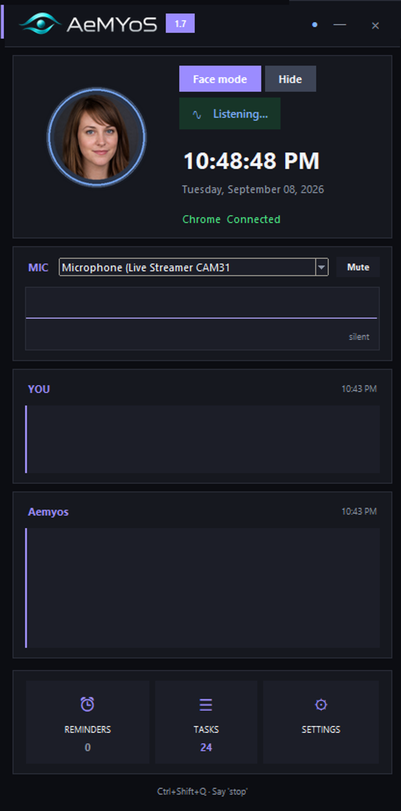
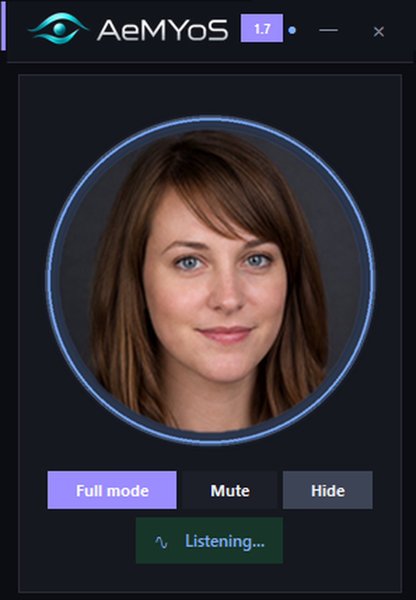

# Aemyos — Windows desktop AI agent

**Aemyos** is a native **Windows desktop AI voice agent**. An always-on-top overlay sees your screen, listens to the microphone, and drives the PC: apps, clicks, keys, volume, Explorer, and Chrome.

This GitHub repository is **`desktop-agent-ai`**. Product site: **[aemyos.ai](https://aemyos.ai)**.

| | |
| --- | --- |
| Product | [Aemyos](https://aemyos.ai) |
| GitHub | [github.com/YSah44/desktop-agent-ai](https://github.com/YSah44/desktop-agent-ai) |
| OS | Windows 10 / 11 |
| Stack | Python, Anthropic Claude, Groq speech, optional Chrome extension |
| Version | 1.8 |

<p align="center">
  <a href="https://github.com/YSah44/desktop-agent-ai/releases/latest/download/Aemyos-Setup.exe"></a>
</p>
<p align="center">
  <a href="https://github.com/YSah44/desktop-agent-ai/releases/latest"></a>
  <a href="https://github.com/YSah44/desktop-agent-ai/releases"></a>
  <a href="LICENSE"></a>
  
</p>
<p align="center">No Python needed for the installer · open source, run from source with Python if you prefer</p>

<p align="center">
  
  &nbsp;
  
</p>

The app is free. You bring your own [Anthropic](https://console.anthropic.com/) and [Groq](https://console.groq.com/) keys (or one [OpenRouter](https://openrouter.ai/) key). Those bills stay on your accounts. **This repository never contains API keys.**

## Windows desktop AI agent (what it does)

Aemyos is a **computer-use / desktop automation** voice assistant that runs on the machine, not in a browser tab:

- Always-on-top overlay, face mode, hide to tray
- Voice in, spoken replies out (Microsoft Edge TTS)
- Screen vision — ask “what’s on my screen?”
- Opens apps, clicks real UI, types, Explorer, Settings, lock, sleep
- Optional **Chrome extension** for tabs, forms, and clicks in Chrome
- English, Turkish, Spanish, German, French
- Destructive actions (empty Recycle Bin, shutdown) need a spoken confirm

Without the Chrome extension it still uses the keyboard and the screen.

## Download (Windows installer)

**[Aemyos-Setup-1.8.exe](https://github.com/YSah44/desktop-agent-ai/releases/latest/download/Aemyos-Setup.exe)** — Windows 10 / 11, **no Python needed**. Download, double-click, Next. On first start paste your keys in Settings (kept in `%APPDATA%\Aemyos\.env`).

SHA256 of `Aemyos-Setup-1.8.exe`:

```
324987202fa9b8e85cf5735c67974bfc5b3c22937d8bf6d19169e656db96f2c4
```

Check it in PowerShell: `Get-FileHash Aemyos-Setup-1.8.exe -Algorithm SHA256` — all releases: [releases](https://github.com/YSah44/desktop-agent-ai/releases).

The installer, `Aemyos.exe` and the uninstaller are code-signed with a Microsoft-verified certificate (Azure Trusted Signing, publisher *david sahbaz*). Right-click the file → Properties → Digital Signatures to check.

Build it yourself: `build.bat` (PyInstaller + Inno Setup) → `dist\Aemyos-Setup-1.8.exe`.

## Install from source (developers)

### 1. Python 3.10+

Install from [python.org](https://www.python.org/downloads/windows/). Enable **Add python.exe to PATH**.

### 2. Clone this repo

```bat
git clone https://github.com/YSah44/desktop-agent-ai.git
cd desktop-agent-ai
```

ZIP: [Download ZIP](https://github.com/YSah44/desktop-agent-ai/archive/refs/heads/main.zip)

### 3. One-click setup

Double-click **`install.bat`**.

It will:

1. Create a local `venv`
2. Install `requirements.txt`
3. Copy `.env.example` → `.env` (if you do not already have one)
4. Open Notepad so you can paste **your** keys

Do not commit `.env`. Do not paste keys into GitHub issues.

### 4. Keys

| Key | Where | Used for |
| --- | --- | --- |
| `ANTHROPIC_API_KEY` | [console.anthropic.com](https://console.anthropic.com/) | Thinking / vision |
| `GROQ_API_KEY` | [console.groq.com](https://console.groq.com/) | Speech recognition |
| `OPENROUTER_API_KEY` | optional | One key for think + listen if `DAVI_PROVIDER=openrouter` |

### 5. Run

Double-click **`start.bat`**. Overlay appears. Speak. Say **stop** or **Ctrl+Shift+Q** to quit.

```bat
venv\Scripts\python.exe -u main.py
```

## Chrome extension (optional)

Folder in this repo: [`chrome-extension`](https://github.com/YSah44/desktop-agent-ai/tree/main/chrome-extension)

1. Run `setup_extension.bat` or open `chrome://extensions`
2. Enable Developer mode
3. Load unpacked → the `chrome-extension` folder

## Safety

- Recycle Bin empty / PC restart require a spoken confirm
- Mic mute and push-to-talk live in Settings
- Developer preview: it can click and type on your desktop. Use a PC you own.

## Donate

If this helps, a gift covers time and API bills.

<a href="https://www.buymeacoffee.com/aemyos"></a>

Prefer crypto? Each coin to its own address — [aemyos.ai/donate.html](https://aemyos.ai/donate.html)

**Bitcoin**


`bc1qrx62dfggt9hsgpvtgd666adylpnc9dr2jr6tqn`

**Solana**


`5UBEsAtqgTmAPhjEgrJ4NgSKXZJQ6QkcpbNL5LiVyUBC`

**ETH / EVM**


`0x76E0Ab339ce38Cd3174a4096C5CaDb7cd587a00e`

Ethereum, Base, Arbitrum, Optimism, Polygon, BNB Chain, Avalanche.

## License

Developer preview. Use on a machine you own. You are responsible for what you ask it to do.

Questions: [aemyos.ai/contact.html](https://aemyos.ai/contact.html) · `support@aemyos.ai`
